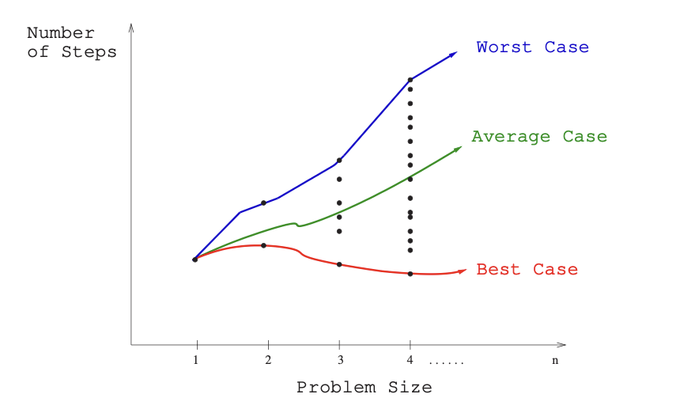
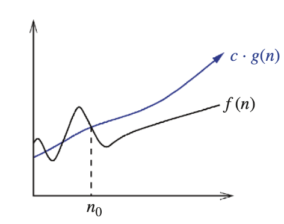
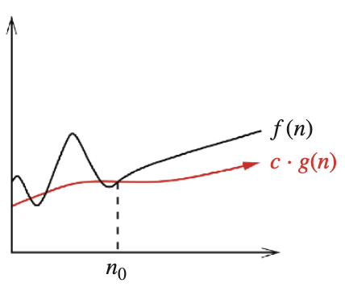
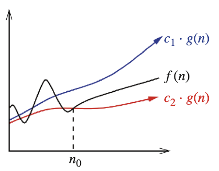

# Introduction to Algorithms and Computational Problems

## Definitions and Terminology

:::{.callout-note title="Definition: Algorithm"}
An  **algorithm** is a finite, well-defined sequence of computational steps or procedures that takes some value, or set of values, as *input* and produces some value, or set of values, as *output*.
:::

Informally, it represents the core logical "idea" behind any reasonable computer program, formulated in a language- and machine-independent way. An algorithm is said to **solve** a computational problem if it correclty maps every valid input instance to the correct output. 

A distinction exists between a **computational problem** and an **instance** of that problem:

- **Computational Problem**: A general description of an input/output relationship, specifying what properties the input must satisfy and what properties the output must have.
- **Instance of a Problem**: A specific set of inputs (satisfying all constraints of the problem statement) needed to compute a solution.

:::{.callout-tip title="Example: Sorting Problem" appearance="simple"}
**Sorting Problem**: Given a list of numbers, the task is to arrange them in ascending order.

- *Input*: A sequence of $n$ numbers $\langle a_1, a_2, \dots, a_n \rangle$.
- *Output*: A permutation (reordering) $\langle a_1', a_2', \dots, a_n' \rangle$ of the input sequence such that $a_1' \leq a_2' \leq \dots \leq a_n'$.
- *Instance*: The sequence $\langle 3, 1, 4, 1, 5, 9 \rangle$ is an instance of the sorting problem, which a correct sorting algorithm will transform into the output sequence $\langle 1, 1, 3, 4, 5, 9 \rangle$.
:::

## Properties of a Well-Defined Algorithm

To be considered well-defined and practically useful, an algorithm must meet several rigorous criteria:

1. **Finiteness**: It must terminate after a finite number of steps on any valid input instance.
2. **Precision**: Every computational step must be uniquely and unambiguously specified.
3. **Correctness**: It must guarantee the optimal or desired answer over all possible inputs, rather than just "usually" working.

# Measuring Performance and Complexity: Empirical vs. Theoretical Analysis

## The concept of efficiency

**Algorithm efficiency** describes the relationship between the size of a problem $(n)$ and the computational resources required by an algorithm to solve it. The primary resources of concern are **Time Complexity** (how execution time or computational steps grow with input size) and **Space Complexity** (how memmory requirements scale with input size). Although other physical resources such as disk I/O, network communication bandwidth, and energy consumption can be relevant in specific contexts, execution time and memory remain our primary analytical focus because they strongly dictate an application's scalability.

## Performance (Empirical) vs. Complexity (Theoretical)

There are two complementary ways of evaluating algorithm efficiency: **empirical performance analysis** and **theoretical complexity analysis**.

| Dimension | Empirical Performance Analysis | Theoretical Complexity Analysis |
|-----------|-------------------------------|--------------------------------|
| **Primary Question** | "What resources *were actually used* by this implementation?" | "How do the resource requirements *scale abstractly* as a function of $n$?" |
| **Methodology** | Measured by running compiled/interpreted code on actual physical hardware under specific conditions. | Mathematically modeled by counting primitive operational steps as a function of input size $n$. |
| **Hardware Dependence** | Deeply dependent on the physical machine, operating system, cache hierachy, compiler, and language. | Machine-independent; abstracts away hardware details to evaluate the core algorithm. |
| **Example Measures** | 2.4 seconds, 500 MB of RAM, 30 Joules. | $T(n) = 3n + 2$ steps, $S(n) = n$ memory units. |

## The Random-Access Machine (RAM) Model

To facilitate machine-independent analysis, computer scientists evaluate algorithms on a hypothetical computer called the **Random-Access Machine (RAM) model of computation**. The RAM model assumes a single-processor computer where instructions are executed strictly sequentially with no concurrency. Under this model:

- Every **simple operation** (such as addition $+$, subtraction $-$, multiplication $*$, assignment $=$, comparison `if`, or  subroutine call) takes exactly **one time step**.
- Every **memory access** (load, store, copy) takes exactly **one time step**.
- Memory is assumed to be infinite, and the model ignores any performance differences between cache, RAM, or disk.
- **Complex operations** (such as loops or nested subroutines) are *not* single steps; their cost is the sum of the simple operations that compose them.

We measure the run time of an algorithm by counting the number of RAM instructions executed on a given input instance.

## Algorithm Performance Scenarios

An algorithm's behavior can vary significantly between different inputs of the exact same size $n$. To summarize this behavior, we define three standard functions over the set of all possible input instances:



- **Best-case complexity**: The minimum number of primitive operations required by the algorithm over any possible input instance of size $n$. It represents the absolute fastest execution time for a given input size.
- **Worst-case complexity**: The maximum number of primitive operations required by the algorithm over any possible input instance of size $n$. It represents a guaranteed upper bound on execution time, ensuring that the algorithm will never run slower than this limit.
- **Average-case complexity**: The expected number of steps executed by the algorithm over all possible input instances of size $n$, often assuming a uniform probability distribution over the inputs. Average-case analysis is particularly vital for analyzing randomized algorithms.

# Mathematical foundations of Asymptotic Analysis

## Asymptotic Analysis Core Idea

:::{.callout-note title="Definition: Asymptotic Analysis"}

**Asymptotic analysis** is a methodology used to describe the efficiency of algorithms as the input size $n$ grows arbitrarily large, approaching infinity $n\to \infty$. In this limit, the exact step count $T(n)$ becomes less critical than the **dominant growth rate**.
:::

Asymptotic analysis suppresses constant factors and lower-order terms, because as $n$ grows, their relative impact is entirely dwarfed by the highest-power term.

:::{.callout-tip title="Example" appearance="simple"}
Given two running-time functions:

$$
f(n) = 100n \qquad \text{and} \qquad g(n)= n^2+5
$$

For small inputs ($n<100$), $f(n)$ is larger. However, there is a *crossover point* ($n_0=100$), beyond which the quadratic term of $g(n)$ dominates. As $n\to \infty$, $g(n)$ grows infinitely faster than $f(n)$, making $f(n)$ asymptotically superior because its resource footprint grows slower.

```{python}
import numpy as np
import matplotlib.pyplot as plt

n = np.arange(1, 200)
f_n = 100 * n
g_n = n**2 + 5

plt.plot(n, f_n, label='f(n) = 100n')
plt.plot(n, g_n, label='g(n) = n^2 + 5')
# note the crossover point
plt.axvline(x=100, color='gray', linestyle='--', label='Crossover Point (n=100)')
plt.xlabel('Input Size (n)')
plt.ylabel('Running Time')
plt.title('Asymptotic Behavior of Two Functions')
plt.legend()
plt.show()
```

:::

## Big O, Big Omega, and Big Theta

To formalize these limits, we utilize three primary mathematical notations. Let $t(n):\mathbb N \to \mathbb R$ bbe the actual running time function of an algorithm, and let $f(n)$ be an abstract bounding function.

### Big-O Notation (Asymptotic Upper Bound)

:::{.callout-note title="Definition: Big-O Notation"}
We say that $t(n)$ is **Big-O of $f(n)$**, denoted as $t(n) \in O(f(n))$, if and only if there exist positive real constants $c$ and $n_0$ such that for all $n \geq n_0$:
$$
t(n) \leq c \cdot f(n)
$$
:::



This notation characterizes an asymptotic upper bound: eventually, the actual growth rate $t(n)$ grows no faster than a constant multiple of $f(n)$. While it is true to state that a linear function $5n+2$ is $O(n^2)$ or $O(n^3)$, we always strive to make the upper bound as *tight as possible* by reporting $O(n)$.

:::{.callout-tip title="Example" appearance="simple"}

To prove that $t(n) = 5n+2 \in O(n)$, we must find valid positive constants $c$ and $n_0$ such that $5n+2\leq c\cdot n$. Selecting $c=6$ and $n_0=3$ yields:
$$
5(3) + 2 = 17 \leq 6(3) = 18
$$
thus, for all $n \geq 3$, the inequality holds, confirming that $t(n) \in O(n)$.
:::

### Big-Omega Notation (Asymptotic Lower Bound)

:::{.callout-note title="Definition: Big-Omega Notation"}
We say that $t(n)$ is **Big-Omega of $f(n)$**, denoted as $t(n) \in \Omega(f(n))$, if and only if there exist positive real constants $c$ and $n_0$ such that for all $n \geq n_0$:
$$
t(n) \geq c \cdot f(n)
$$
:::



This notation characterizes an asymptotic lower bound: eventually, the algorithm's execution rate will require at least a constant multiple of $f(n)$ steps for all inputs larger than $n_0$.

### Big-Theta Notation (Asymptotically Tight Bound)

:::{.callout-note title="Definition: Big-Theta Notation"}
We say that $t(n)$ is **Big-Theta of $f(n)$**, denoted as $t(n) \in \Theta(f(n))$, if and only if there exist positive real constants $c_1$, $c_2$, and $n_0$ such that for all $n \geq n_0$:
$$
c_1 \cdot f(n) \leq t(n) \leq c_2 \cdot f(n)
$$
:::



This notation defines a tight bound, meaning $t(n)$ and $f(n)$ grow at the same asymptotic rate within constant scale factors.

The relationship between these three notations can be summarized as follows:

:::{.callout-caution title="Theorem: The Tight-Bound Theorem"}

For any two functions $f(n)$ and $g(n)$,

$$
f(n) = \Theta(g(n)) \iff f(n) = O(g(n)) \text{ and } f(n) = \Omega(g(n))
$$

:::

## Algebraic Manipulation and Operational Rules

When simplifying complexity expressions, we adhere to several basic rules of function summation and multilication:

- **The Addition Rule (Sum of Functions)**: The sum of two growth functions is governed entirely by the dominant term.

$$
f(n) + g(n) = \Theta(\max(f(n), g(n)))
$$

*Example*: $n^3+n^2+n+1\to \Theta(n^3)$ because $n^3$ dominates.

- **The Multiplication Rule**: Constant factors are ignored because they represent hardware-specific details that do not scale with $n$.

$$
O(c\cdot f(n)) \to O(f(n))
$$

If $f_1(n)\in O(g_1(n))$ and $f_2(n)\in O(g_2(n))$, then $f_1(n)\cdot f_2(n) \in O(g_1(n)\cdot g_2(n))$.

- **The Polynomial Dominance Rule**: If $t(n)$ is a polynomial of degree $d$, then $t(n) \in \Theta(n^d)$.

$$
a_mn^m + a_{m-1}n^{m-1} + \dots + a_1n + a_0 \in \Theta(n^m)
$$

We systematically *drop lower-order terms* and *drop constant factors*.

*Example*: $7n^3+20n^2+4n\in O(n^3)$.

# The Landscape of Growth Classes and Dominance Relations

## The Dominance Pecking Order

To compare algorithms, we arrange common growth functions in a strict dominance hierachy. 

:::{.callout-note title="Definition: Dominance Relation"}

We say that a function $g(n)$ **dominates** a function $f(n)$, denoted $g(n) \gg f(n)$, if and only if:

$$
f(n) \in O(g(n)) \quad \text{and} \quad g(n) \notin O(f(n))
$$

:::

The standard dominance pecking order, including advanced and esoteric analysis function, is:

$$
n! \gg c^n \gg n^3 \gg n^2 \gg n^{1+\epsilon}\gg n\log n \gg \sqrt{n} \gg n \gg \log n \gg 1
$$

## Detailed Profiles of Growth Classes

### Constant Time: $O(1)$

- **Mathematical Concept**: The resource footprint is completly independent of the parameter $n$. The algorithm executes a fixed number of operations regardless of input size.
- **Operational Definition**: $T(n) = c$ steps.
- **Canonical Code Template**:

```{python}
def get_first_element(arr):
    return arr[0]  # Accessing the first element is a constant-time operation
```

- **Common Real-World Examples**: 
  - Retrieving a risk profile in fraud detection using a known unique account ID.
  - `Push` and `Pop` operations on a stack structure.
  - Accessing or updating a single value in an array.

### Logarithmic Time: $O(\log n)$

- **Mathematical Concept**: Logarithms grow exceptionally slowly because they represent the inverse of exponential growth. Logarithmic time arises in any process where the problem space is *repeatedly halved*. The base of the logarithm does not affect the asymptotic class because changing bases only introduces a constant multiplier.
- **Operational Definition**: $T(n) = T(n/2) + O(1)$.
- **Canonical Code Template**:

```{python}
def binary_search_digits(n):
    count = 0
    while n > 0:
      n = n // 2 # repeated halving 
      count += 1
    return count
```

- **Common Real-World Examples**: 
  - Searching for a name in a sorted database containing millions of records (Binary Search).
  - `Insert` and `Find` operations in a balanced Binary Search Tree (BST) with $n$ nodes.

### Linear Time: $O(n)$

- **Mathematical Concept**: The computational time scales in direct, 1-to-1 proportion with the size of the input $n$. Looking at every time in an input array a constant number of times yields linear complexity.
- **Operational Definition**: $T(n) = c\cdot n$.
- **Canonical Code Template**:

```{python}
def find_max_element(arr):
    max_val = arr[0]
    for element in arr: # traverse the list of size $n$ exactly once
        if element > max_val:
            max_val = element
    return max_val
```

- **Common Real-World Examples**: 
  - Sequential search in an unsorted list.
  - Fraud screening: checking every financial transaction once.

### Superlinear / Log-linear Time: $O(n\log n)$
- **Mathematical Concept**: This class typically characterizes divide-and-conquer strategies, where a problem of size $n$ is divided into smaller subproblems, solved recursively, and recombined using linera-time overhead.
- **Operational Definition**: $T(n) = 2T(n/2) + O(n)$.
- **Canonical Code Template**:
```{python}
def merge_sort(arr):
    if len(arr) <= 1:
        return arr
    mid = len(arr) // 2 # divide the array into two halves
    left_half = merge_sort(arr[:mid]) # recursively sort the left half
    right_half = merge_sort(arr[mid:]) # recursively sort the right half
    return merge(left_half, right_half)
```

- **Common Real-World Examples**: 
  - Merge Sort and Quick Sort algorithms.
  - Sorting candidate movie recommendations by relevance score.

### Quadratic Time: $O(n^2)$

- **Mathematical Concept**: Running time grows proportionally to the square of the input size $n$. If input size increases by a factor of 10, computation steps increase by a factor of 100. It typically arises in algorithms utilizing doubly nested loops.
- **Operational Definition**: $T(n) = c\cdot n^2$.
- **Canonical Code Template**:
```{python}
def find_duplicates(arr):
    n = len(arr)
    for i in range(n):
        for j in range(i + 1, n): # nested loop over the array
            if arr[i] == arr[j]:
                return True
    return False
```

- **Common Real-World Examples**: 
  - Document similarity matching: comparing every document in a corpus against every other document.
  - Elementary sorting techniques like Selection Sort and Insertion Sort.

### Cubic Time: $O(n^3)$

- **Mathematical Concept**: Enumerates all triples of items in an $n$-element universe, typically implemented via triply nested loops.
- **Operational Definition**: $T(n) = c\cdot n^3$.
- **Canonical Code Template**:
```{python}
def cubic_matrix_multiplication(A, B, n):
    C = [[0] * n for _ in range(n)]  # Initialize result matrix
    for i in range(n):
        for j in range(n):
            for k in range(n):  # Triple nested loop
                C[i][j] += A[i][k] * B[k][j]
    return C
```

- **Common Real-World Examples**:
  - Naive dense Matrix Multiplication.
  - Certain dynamic programming algorithms, such as the Floyd-Warshall algorithm for finding shortest paths in a weighted graph.

### Exponential Time: $O(a^n)$ for $a>1$.
- **Mathematical Concept**: The amount of computation steps grows by a constant factor $a$ for every single increment of 1 in the input size $n$. These algorithms quickly become completely impractical for inputs $n\geq 40$.
- **Operational Definition**: $T(n) = T(n-1) + T(n-2)$.
- **Canonical Code Template**:

```{python}
def recursive_fibonacci(n):
    if n <= 1:
        return n
    # generate a binary recursion tree of height n
    return recursive_fibonacci(n - 1) + recursive_fibonacci(n - 2)
```

- **Common Real-World Examples**: 
  - Exhaustive combinatorial decision making: evaluating every possible subset of candidate variables.
  - [The Tower of Hanoi](https://en.wikipedia.org/wiki/Tower_of_Hanoi) puzzle.
  
### Factorial Time: $O(n!)$.
- **Mathematical Concept**: Computation scales with the factorial function, which grows faster than even standard exponentials. Generating or inspecting every permutation of $n$ elements yields factorial complexity. It becomes computationally useless for $n\geq 20$.
- **Operational Definition**: $T(n) = n \cdot T(n-1)$.
- **Canonical Code Template**:
```{python}
def generate_permutations(arr):
    if len(arr) == 0:
        return [[]]  # Base case: one permutation of an empty list
    permutations = []
    for i in range(len(arr)):
        # Generate all permutations of the remaining elements
        remaining = arr[:i] + arr[i+1:]
        for p in generate_permutations(remaining):
            permutations.append([arr[i]] + p)
    return permutations
```

- **Common Real-World Examples**: 
  - Generating every possible ordering of $n$ parts to verify structural priority (Topological Sort via exhaustive search).
  - Solving the Traveling Salesman Problem (TSP) using naive exhaustive permutation testing.

## Advanced Complexity and Esoteric Growth Classes

Advanced algorithmic analysis occasionally encounters more specialized growth classes:

- **Inverse Ackermann's Function**: $O(\alpha(n))$. The inverse of the rapidly growing Ackermann's function. It represents the absolute slowest-growing non-constant complexity class. $\alpha(n)$ is smaller than 5 for any conceivable input size $n$ in our physical universe, yet mathematically it still approaches infinity as $n\to \infty$. It classically found in the amortized analysis of the Union-Find data structure.
- **Double Logarithm**: $O(\log \log n)$. Grows even slower than $\log n$. It describes processes like performing a binary search on a sorted array of only $\log n$ items.
- **Sublinear Polynomials**: $O(\sqrt {n})$. These functions frequently arise when dividing spatial databases or multidimensional grids containing $n$ points into root-node partitions.
- **Epsilon Polynomials**: $O(n^{1+\epsilon})$ for any $\epsilon>0$. Represents a class of functions slightly larger than linear but strictly better than quadratic. It appears when a parameter can be adjusted to balance constant overhead and power growth.

# Methodology of Algorithmic Analysis

## ADT vs. Data Structure vs. Concrete Data Type

To write efficient code, we must understand the logical layers of data organization.
```
  ┌─────────────────────────────────────────────────────────┐
  │ 1. Abstract Data Type (ADT)                             │
  │    - Specifies values and supported operations          │
  │    - "What does the structure do?" (No implementation)  │
  └────────────────────────────┬────────────────────────────┘
                               ▼
  ┌─────────────────────────────────────────────────────────┐
  │ 2. Data Structure                                       │
  │    - Specifies physical arrangement and algorithm       │
  │    - "How are the operations carried out?"              │
  └────────────────────────────┬────────────────────────────┘
                               ▼
  ┌─────────────────────────────────────────────────────────┐
  │ 3. Concrete Data Type                                   │
  │    - Language-specific physical implementation          │
  │    - Python list, User-defined class                    │
  └─────────────────────────────────────────────────────────┘

```
1. **Abstract Data Type (ADT)**: A pure mathematical specification of a collection of data values and the operations supported, completely devoid of implementation detail. E.g., the *List ADT* specifies a sequence of values with operations like `insert`, `delete`, and `get`, but does not dictate how these operations are implemented.
2. **Data Structure**: A physical scheme to store and organize data in memory to faciliate efficient access and modifications. E.g., a *Linked List* or *Dynamic Array* representing two distinct implementation strategies for the List ADT.
3. **Concrete Data Type**: A specific implementation of a data structure in a programming language. E.g., a Python `list` or a C++ `std::vector` are concrete data types that implement the List ADT using dynamic arrays.
4. **Impact of Data Organization on Cost**: Organizing the same data in different structures alters operation complexity. Consider the **membership testing** operation (`x in collection`) at scale:
    - Python `list` (Dynamic Array data structure): Requires $O(n)$ linear traversal because elements are stored consecutively in memory, necessitating sequential checking.
    - Python `set` (Hash Table data structure): Requires $O(1)$ constant time because the hashing function maps keys directly to specific memory addresses, bypassing traversal.

## Case Study 1: Selection Sort Analysis

The Selection Sort algorithm repeatedly identifies the minimum remaining unsorted element and exchanges it with the element at the boundary of the sorted partition. 

> **Selection Sort Python Implementation**:

```{python}
def selection_sort(arr):
    n = len(arr)
    for i in range(n):
        min_idx = i
        for j in range(i + 1, n):
            if arr[j] < arr[min_idx]:
                min_idx = j
            arr[i], arr[min_idx] = arr[min_idx], arr[i]  # Swap the found minimum element with the first unsorted element
```

To compute the exact step complexity $T(n)$ under the RAM model, we count the number of comprarisons executed in the inner loop:

- When $i=0$, the inner loop index $j$ runs from 1 to $n-1$ ($n-1$ steps).
- When $i=1$, the inner loop index $j$ runs from 2 to $n-1$ ($n-2$ steps).
- ...
- In general, the $i$-th iteration of the outer loop executes exactly $n-i-1$ steps of the inner loop.

Summing these steps yields:

$$
T(n) = (n-1) + (n-2) + \dots + 2 + 1 = \sum_{i=0}^{n-1} (n-i-1) = \frac{n(n-1)}{2} = \frac{n^2-n}{2}
$$

Applying asymptotic simplification rules (dropping constant factors and lower-order terms):

$$
T(n) \in \Theta(n^2) (\text{quadratic time complexity})
$$

## Case Study 2: Matrix Multiplication Analysis

Nested loops are a common source of polynomial time complexity. Consider the naive algorithm for multiplying two $n \times n$ matrices $A$ and $B$ to produce a result matrix $C$.

> **Naive Matrix Multiplication Python Implementation**

```{python}
def matrix_multiply(A, B, x, y, z):
    """
    A is of size x * y, B is of size y * z, and C will be of size x * z.
    """
    C = [[0] * z for _ in range(x)]  # Initialize result matrix
    for i in range(x):
        for j in range(z):
            for k in range(y):
                C[i][j] += A[i][k] * B[k][j]
    return C
```

The total number of multiplication steps $M(x, y, z)$ is represented by three nested summations:

$$
M(x, y, z) = \sum_{i=0}^{x-1} \sum_{j=0}^{z-1} \sum_{k=0}^{y-1} 1 = x \cdot z \cdot y
$$

Evaluating the nested summations from the innermost outward:
1. The innermost sum of 1 from 1 to $y$ is simply $y$:
$$
\sum_{k=0}^{y-1} 1 = y
$$
2. The sum of the constant $y$ from 1 to $z$ yields $y \cdot z$:
$$
\sum_{j=0}^{z-1} y = y \cdot z
$$
3. Finally, summing $y \cdot z$ from 1 to $x$ gives $x \cdot y \cdot z$:
$$
\sum_{i=0}^{x-1} y \cdot z = x \cdot y \cdot z
$$

If we consider the common case of multiplying two square matrices of dimension $n\times n$ (where $x=y=z=n$), the complexity simplifies to:

$$
M(n) = n^3 \in \Theta(n^3) (\text{cubic time complexity})
$$

## Case Study 3: Merge Sort & Divide-and-Conquer Recurrences

Divide-and-conquer algorithms operate by recursively calling themselves on smaller instances of a problem. The running time of such recursive structures is formally modeled using **recurrence equation**.

A recurrence equation describes the overall running time $T(n)$ of a problem of size $n$ in terms of the running time of smaller inputs. For a standard divide-and-conquer algorithm that divides a problem into $a$ subproblems, each of size $1/b$ of the original, with dividing cost $D(n)$ and combining cost $C(n)$, the recurrence relation is:

> **General Recurrence Equation for Divide-and-Conquer**

$$
T(n) = \cases{
  \Theta(1), & if $n \leq c$\\
  a T(n/b) + D(n) + C(n), & otherwise
}
$$

For **Merge Sort**, we assume $n$ is an exact power of 2 for simplicity. The algorithm divides the array into $a=2$ subproblems, each of size have exactly $n/b = n/2$. 

- **Dividing Cost** $D(n)$: Finding the middle of the array takes constant time, $D(n) = \Theta(1)$. 

- **Combining Cost** $C(n)$: Merging two sorted subarrays of total size $n$ requires linear time, $C(n) = \Theta(n)$.

This yields the classical recursive equation:

$$
T(n) = 2 T(n/2) + \Theta(n)
$$

To solve this recurrence, we construct a **recursion tree**:

```
Level 0:                         cn                      Total cost: cn 
                                /  \
Level 1:                   cn/2      cn/2                Total cost: 2*(cn/2) = cn 
                           /  \      /  \
Level 2:               cn/4  cn/4  cn/4  cn/4            Total cost: 4*(cn/4) = cn 
                       / \   / \   / \   / \
                       ...
Level log n:          c   c   c   c   c   c   c          Total cost: n*c = cn 

```

- **Height of Tree**: The input size is repeatedly halved until it reaches size 1. The number of divisions required is $\log n$, resulting in $\log n + 1$ total levels in the recursion tree.
- **Cost per level**: The $i$-th level below the top has $2^i$ nodes, each contributing a computational cost of $c \cdot n / 2^i$. Thus, the total cost at level $i$ is:

$$
2^i \cdot c \cdot \frac{n}{2^i} = c \cdot n
$$

- **Summing Level Costs**: Summing the uniform cost of $cn$ across all $\log n + 1$ levels yields:

$$
T(n) = c\cdot n \cdot (\log n + 1) = c \cdot n \log n + c \cdot n
$$

Dropping lower-order terms and constant coefficients, we prove:

$$
T(n) \in \Theta(n \log n) (\text{log-linear time complexity})
$$

# Standard Mathematical Summation Formulas

When performing complexity analysis on loop structures, the following mathematical closed-form summations are frequently applied:

## Arithmetic Progression (Sum of Linear Range)

The sum of the first $n$ natural numbers:

$$
\sum_{i=1}^{n} i = 1+ 2+ \dots + n = \frac{n(n+1)}{2} \in \Theta(n^2)
$$

More generally, for any power $p\geq 0$:

$$
\sum_{i=1}^{n} i^p \in \Theta(n^{p+1})
$$

## Geometric Progression 

A summation where the index affects the exponent:

$$
\sum_{i=0}^{n} a^i = 1 + a + a^2 + \dots + a^n = \frac{a^{n+1}-1}{a-1} 
$$

The asymptotic behavior depends on the base $a$:
- If $\mid a \mid < 1$, the sum converges to a constant as $n \to \infty$:

$$
\sum_{i=0}^{\infty} a^i = \frac{1}{1-a} \leq C \in \Theta(1).
$$
This is the "free lunch" of algorithm analysis, showing that the sum of an infinite progression can be bounded by a constant.
- If $a=1$, the sum grows linearly with $n$:
$$
\sum_{i=0}^{n} 1^i = n+1 \in \Theta(n)
$$
- If $a>1$, the sum grows exponentially with $n$:
$$
\sum_{i=0}^{n} a^i = \frac{a^{n+1}-1}{a-1} \in \Theta(a^n)
$$

## Harmonic Series

The sum of reciprocal integers, which characterizes search patterns in randomized algorithms:

$$
H(n) = \sum_{i=1}^{n} \frac{1}{i} = 1 + \frac{1}{2} + \frac{1}{3} + \dots + \frac{1}{n} \in \Theta(\log n)
$$

