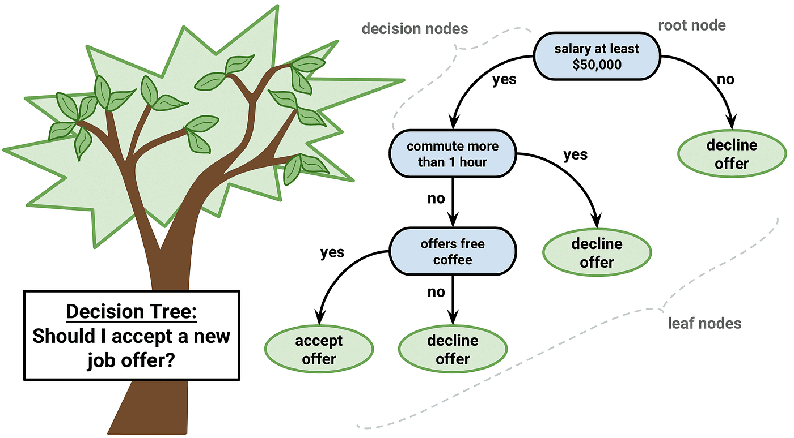

The [previous chapter](chapter-4.qmd) introduced regression as a supervised learning framework for estimating a continuous function
$$
f:\mathcal X \to \mathbb R.
$$
In that setting, the model usually assumes that the response changes smoothly with the input variables. A linear regression model, for example, assumes that each predictor contributes additively and proportionally to the target, unless the analyst manually adds nonlinear features or interaction terms.

Tree-based models take a different view.

Instead of assuming a global equation, a tree-based model divides the feature space into a collection of simpler regions and makes a prediction within each region. The model then asks: "How can input space be split into subpopulations whose outcomes are more homogeneous?"

This makes tree-based models especially useful when the relationship between predictors and target variables is nonlinear, discontinuous, interaction-heavy, or difficult to express through a simple parametric equation.

A decision tree can be understood as a __recursive partitioning model__. Starting from the full dataset, the algorithm repeatedly chooses a feature and a threshold, splits the data into two child nodes, and continues until a stopping rule is reached. The result is a rooted tree:

- internal nodes contain decision rules,
- branches represent outcomes of those rules,
- terminal nodes, or leaves, contain predictions.

The classical framework for this approach is __Classification and Regression Trees__, commonly called __CART__, introduced by Breiman, Friedman, Olshen, and Stone in 1984[^1]. CART formalized tree learning for both regression and classification through recursive binary splitting and cost-complexity pruning.



## 1. Formal Setup

Let the training data be 
$$
\mathcal D_n=\{(x_i, y_i)\}_{i=1}^n
$$
where
$$
x_i = (x_{i1}, x_{i2}, \dots, x_{ip}) \in \mathbb R^p
$$
is a vector of $p$ predictors, and $y_i$ is the response. For regression, $y_i\in \mathbb R$. For classification, $y_i \in \{1, 2, \dots, K\}$. 

A tree model partitions the feature space $\mathcal X\in \mathbb R^p$ into $M$ disjoint regions:
$$
R_1, R_2, \dots, R_m
$$
such that 
$$
R_m\cap R_\ell = \varnothing \quad \text{ for } m\neq \ell
$$
and 
$$
\bigcup_{m=1}^M R_m = \mathcal X
$$
Each region corresponds to one terminal node of the tree. The prediction is constant within each terminal region.

For regression, the tree takes the form
$$
\hat f(x) = \sum_{m=1}^M c_m \times \mathbf I\{x\in R_m\}
$$
where $\mathbf I\{x\in R_m\}$ is an indicator function:
$$
\mathbf I(x\in R_m) = \begin{cases}
1, & x\in R_m\\
0, &x\not \in R_m
\end{cases}
$$
For classification, the tree estimates class probabilities inside each region:
$$
\hat p_{mk}=\frac{1}{N}\sum_{x_i\in R_m} \mathbf I\{y_i=k\}
$$
where $N_m$ is the number of training observations in region $R_m$. The predicted class is usually 
$$
\hat k(x) = \arg \max_k \hat p_{mk}
$$
## 2. Regression Trees

::: {.callout-note title="Definition: Regression Tree"}

_A **regression tree** is a piecewise-constant function_
$$
\hat f(x) = \sum_{m=1}^M c_m \times \mathbf I\{x\in R_m\}
$$
_where the input space is partitioned into disjoint regions $R_1, \dots, R_M$, and each region is assigned a constant prediction $c_m$._

:::

The model is nonparametric in the sense that it does not assume a fixed global equation such as $y = \beta_0 + \beta_1 x_1 + \dots + \beta_p x_p +\epsilon$. Instead, it learns the partition structure from data.

### 2.1. Optimal Leaf Prediction for Squared Error

For a fixed partition $R_1, \dots, R_M$, the regression tree chooses constants $c_1, \dots, , c_M$ to minimizes the sum of square errors:
$$
SSE = \sum_{i=1}^n \left(y_i-\hat f(x_i)\right)^2
$$
Then the objective becomes:
$$
SSE = \sum_{m=1}^{M} \sum_{x_i\in R_m}(y_i-c_m)^2
$$

::: {.callout-tip title="Theorem: Optimal Constant in a Regression Tree Leaf"}

For a fixed terminal region $R_m$, the value of $c_m$ that minimizes 
$$
\sum_{x_i\in R_m} (y_i-c_m)^2
$$
is the sample mean of the response values in that region:
$$
\hat c_m = \frac{1}{N_m}\sum_{x_i\in R_m} y_i
$$

:::


::: {.callout-note title="Proof"}

For a fixed region $R_m$, define
$$
J(c_m) = \sum_{x_i\in R_m} (y_i-c_m)^2.
$$
Differentiate with respect to $c_m$:
$$
\frac{dJ}{dc_m} = \sum_{x_i\in R_m} 2(y_i-c_m)(-1)=-2\sum_{x_i\in R_m}(y_i-c_m).
$$
Set equal to zero:
$$
-2\sum_{x_i\in R_m}(y_i-c_m)=0 \implies \sum_{x_i\in R_m} y_i - \sum_{x_i\in R_m} c_m = 0
$$
Since $c_m$ is constant within the region, $\sum_{x_i\in R_m} c_m = N_mc_m$, thus,
$$
\sum_{x_i\in R_m} y_ i = N_m c_m \implies \hat c_m = \frac{1}{N_m}\sum_{x_i\in R_m} y_i.
$$

:::


### 2.2. Recursive Binary Splitting

The idea tree would search over all possible partitions of $\mathcal X$. However, the number of possible partitions is enormous, and finding the globally optimal tree is computationally infeasible in general. CART therefore uses a __greedy recursive splitting algorithm__.

At a given node containing data $R$, the algorithm considers splits of the form
$$
R_1 (j,s) = \{x\in R: x_j \leq s\},\, R_2(j,s)=\{x\in R:x_j > s\}
$$
where $j\in \{1, \dots, p\}$ is the splitting variable and $s$ is the split threshold.

For regression, the best split solves
$$
(j^*, s^*) = \arg \min_{j,s} \left[\sum_{x_i\in R_1(j,s)}(y_i-\overline y_{R_1})^2 + \sum_{x_i\in R_2(j,s)}(y_i-\overline y_{R_2})^2\right]
$$
where 
$$
\overline y_{R_k}=\frac{1}{N_{R_k}}\sum_{x_i\in R_k(j,s)}y_i.
$$
The split is chosen because is maximally reduces within-node variance.

Equivalently, define the _impurity_ of a regression node $R$ as
$$
Q(R) = \frac{1}{N_R}\sum_{x_i\in R} (y_i-\overline y_R)^2
$$
The total weighted impurity after a split is 
$$
Q_{\text{split}}(j,s)=\frac{N_{R_1}}{N_R}Q(R_1)+\frac{N_{R_2}}{N_R}Q(R_2)
$$
The best split minimizes $Q_\text{split}(j,s)$.

```{python}
#| label: fig-regression-tree-fit
#| fig-cap: "Regression tree fitted function"
import numpy as np
import matplotlib.pyplot as plt
from sklearn.tree import DecisionTreeRegressor, plot_tree

rng = np.random.default_rng(42)

# Simulated nonlinear data
X = np.linspace(0, 10, 120).reshape(-1, 1)
y = np.sin(X).ravel() + 0.25 * rng.normal(size=X.shape[0])

# Fit regression tree
tree = DecisionTreeRegressor(max_depth=3, random_state=42)
tree.fit(X, y)

# Prediction grid
X_grid = np.linspace(0, 10, 500).reshape(-1, 1)
y_pred = tree.predict(X_grid)

# Plot fitted function
plt.figure(figsize=(8, 5))
plt.scatter(X, y, alpha=0.65, label="Observed data")
plt.plot(X_grid, y_pred, label="Regression tree prediction")
plt.title("Regression Tree Fitted Function")
plt.xlabel("x")
plt.ylabel("y")
plt.legend()
plt.tight_layout()
plt.show()
```

```{python}
#| label: fig-regression-tree-structure
#| fig-cap: "Regression tree structure"
# Plot tree structure
plt.figure(figsize=(14, 6))
plot_tree(
    tree,
    feature_names=["x"],
    filled=False,
    rounded=True,
    precision=2
)
plt.title("Regression Tree Structure")
plt.tight_layout()
plt.show()
```

## 3. Classification Trees

::: {.callout-note title="Definition: Classification Tree"}

_A __classification tree__ is a recursive partitioning model for categorical responses $Y\in \{1,\dots, K\}$. Each terminal region $R_m$ estimates class probabilities_
$$
\hat p_mk = \frac{1}{N_m}\sum_{x_i\in R_m} \mathbf I\{y_i=k\}
$$

_and predicts the majority class_
$$
\hat k(x) = \arg \max_k \hat p_mk \quad \text{ for } x\in R_m
$$

_The goal of splitting is to produce child nodes that are more homogeneous than their parent node._

:::

### 3.1. Node Impurity Measures

Unlike regression trees, classification trees do not minimize squared residuals. They minimize __impurity__. A pure node contains observations from only one class. An impure node contains a mixture of classes.

Let $\hat p_{mk}$ be the proportion of class $k$ observations in node $m$.

Three common impurity measures are:

1. Misclassification error,
2. Gini index,
3. Cross-entropy, also called deviance.

#### 3.1.1. Misclassification Error

The misclassification error at node $m$ is
$$
Q_m^{ME} = 1 - \max_k\hat p_{mk}
$$
This measures the error rate if every observation in the node is assigned to the majority class.

For example, if a node has class proportions $(\hat p_{m1}, \hat p_{m2})= (0.8,0.2)$, then 
$$
Q_{m}^{ME} = 1-0.8=0.2.
$$

Misclassification error is simple and interpretable, but it is less sensitive to changes in node purity than Gini or entropy. For this reason, CART often uses Gini for classification splitting and uses misclassification error more naturally for evaluating final tree performance.

#### 3.1.2. Gini Index

The Gini index is 
$$
Q_{m}^{\text{Gini}} = \sum_{k=1}^K\hat p_{mk}(1-\hat p_{mk})
$$

This can also be written as
$$
Q_m^{\text{Gini}} = 1-\sum_{k=1}^K \hat p_{mk}^2
$$

If one randomly labels an observation according to the class distribution in the node, the Gini index is the expected probability of incorrect classification. A pure node has one class probability equal to 1 and all others equal to 0, so  $Q_m^\text{Gini}=0$. A maximal mixed binary node with $\hat p_{m1} = \hat p_{m2}=0.5$ has $Q_m^\text{Gini}=1-(0.5^2+0.5^2)=0.5$.

#### 3.1.3. Cross-Entropy / Deviance

The cross-entropy impurity is
$$
Q_m^\text{Entropy} = -\sum_{k=1}^K \hat p_{mk}\log (\hat p_{mk})
$$

By convention, $0\log0 = 0$. 

Entropy measures uncertainty in the class distribution. A pure node has entropy 0. A uniformly mixed node has high entropy.

For binary classification, if $p=\hat p_{m1}$, then:
$$
Q_m^\text{Entropy}(p) = -p\log p - (1-p)\log (1-p)
$$

Entropy is connected to information theory and likelihood-based classification. It penalizes uncertain class distribution strongly.

```{python}
#| label: fig-classification-impurity
#| fig-cap: "Impurity measures for binary classification"
import numpy as np
import matplotlib.pyplot as plt

p = np.linspace(0.001, 0.999, 500)

gini = 2 * p * (1 - p)
entropy = -(p * np.log(p) + (1 - p) * np.log(1 - p))
misclassification = 1 - np.maximum(p, 1 - p)

plt.figure(figsize=(8, 5))
plt.plot(p, gini, label="Gini index")
plt.plot(p, entropy, label="Entropy")
plt.plot(p, misclassification, label="Misclassification error")
plt.title("Impurity Measures for Binary Classification")
plt.xlabel("Class probability p")
plt.ylabel("Impurity")
plt.legend()
plt.tight_layout()
plt.show()
```

### 3.2. Example: Heart Disease Rule Tree

Suppose a simplified health dataset contains the following predictors:
$$
X_1 = \text{Exercise}, X_2=\text{Smoking}, X_3 =\text{Age}, X_4=\text{Blood Pressure}
$$
The response is
$$
Y\in \{\text{Healthy, At Risk}\}
$$

```{python}
#| label: fig-health-risk-tree
#| fig-cap: "Classification tree for simplified health risk"
import numpy as np
import pandas as pd
import matplotlib.pyplot as plt
from sklearn.tree import DecisionTreeClassifier, plot_tree
from sklearn.preprocessing import OneHotEncoder
from sklearn.compose import ColumnTransformer
from sklearn.pipeline import Pipeline

rng = np.random.default_rng(7)
n = 180

exercise = rng.choice(["Yes", "No"], size=n, p=[0.55, 0.45])
smoking = rng.choice(["Yes", "No"], size=n, p=[0.35, 0.65])
age = rng.normal(50, 12, size=n)
blood_pressure = rng.normal(130, 15, size=n)

risk_score = (
    (exercise == "No").astype(int) * 1.2
    + (smoking == "Yes").astype(int) * 1.5
    + 0.04 * (age - 50)
    + 0.03 * (blood_pressure - 130)
    + rng.normal(0, 0.5, size=n)
)

target = np.where(risk_score > 1.2, "At Risk", "Healthy")

df = pd.DataFrame({
    "exercise": exercise,
    "smoking": smoking,
    "age": age,
    "blood_pressure": blood_pressure,
    "target": target
})

X = df.drop(columns=["target"])
y = df["target"]

categorical_features = ["exercise", "smoking"]
numeric_features = ["age", "blood_pressure"]

preprocess = ColumnTransformer([
    ("cat", OneHotEncoder(drop=None), categorical_features),
    ("num", "passthrough", numeric_features)
])

clf = Pipeline([
    ("preprocess", preprocess),
    ("tree", DecisionTreeClassifier(max_depth=3, random_state=42))
])

clf.fit(X, y)

feature_names = clf.named_steps["preprocess"].get_feature_names_out()

plt.figure(figsize=(16, 7))
plot_tree(
    clf.named_steps["tree"],
    feature_names=feature_names,
    class_names=clf.named_steps["tree"].classes_,
    filled=False,
    rounded=True,
    precision=2
)
plt.title("Classification Tree for Simplified Health Risk")
plt.tight_layout()
plt.show()
```

## 4. Pruning and Model Complexity

### 4.1. Why Trees Overfit

A fully grown decision tree can often fit the training data extremely well. If allowed to keep splitting until every terminal node contains only one or a few observations, the tree can memorize noise.

In regression, this means the training SSE may become very small. In classification, the training error may approach zero. But a tree with very low training error may generalize poorly.

This is the same [generalization](chapter-4.qmd#regularized-regression) problem discussed in the previous chapter, but the mechanism is different. For regression, overfitting may appear as an overly complex polynomial curve. For trees, overfitting appears as an overly fragmented partition of the feature space.

### 4.2. Cost-Complexity Pruning

CART addresses overfitting using __cost-complexity pruning__. The idea is to first grow a large tree $T_0$, then prune it back to smaller subtrees.

Let $T$ be a subtree of $T_0$, and let $|T|$ denote the number of terminal nodes in $T$. Define
$$
R(T) = \sum_{m=1}^{|T|} N_mQ_m(T),
$$
where $Q_m(T)$ is the impurity or loss in terminal node $m$.

The cost-complexity criterion is 
$$
C_\alpha(T) = R(T) + \alpha |T|,
$$
where $a\geq 0$ is a tuning parameter.

- If $\alpha = 0$, the criterion favors the largest tree with lowest training error.
- If $\alpha$ is large, the criterion penalizes complexity more heavily and favors a smaller tree.

::: {.callout-note title="Cost-Complexity Pruning"}

_Cost-complexity pruning selects a subtree_
$$
T_\alpha = \arg\min_{T\subseteq T_0}[R(T)+\alpha|T|].
$$
_The parameter $\alpha$ controls the tradeoff between empirical fit and tree size._

:::

```{python}
#| label: fig-cost-complexity-pruning
#| fig-cap: "Cost-complexity pruning performance versus number of leaves"
import numpy as np
import matplotlib.pyplot as plt
from sklearn.tree import DecisionTreeRegressor
from sklearn.model_selection import train_test_split
from sklearn.metrics import mean_squared_error

rng = np.random.default_rng(42)

X = np.linspace(0, 10, 250).reshape(-1, 1)
y = np.sin(X).ravel() + 0.3 * rng.normal(size=X.shape[0])

X_train, X_test, y_train, y_test = train_test_split(
    X, y, test_size=0.35, random_state=42
)

base_tree = DecisionTreeRegressor(random_state=42)
path = base_tree.cost_complexity_pruning_path(X_train, y_train)
ccp_alphas = path.ccp_alphas

train_rmse = []
test_rmse = []
leaf_counts = []

for alpha in ccp_alphas:
    tree = DecisionTreeRegressor(random_state=42, ccp_alpha=alpha)
    tree.fit(X_train, y_train)

    train_pred = tree.predict(X_train)
    test_pred = tree.predict(X_test)

    train_rmse.append(mean_squared_error(y_train, train_pred) ** 0.5)
    test_rmse.append(mean_squared_error(y_test, test_pred) ** 0.5)
    leaf_counts.append(tree.get_n_leaves())

plt.figure(figsize=(8, 5))
plt.plot(leaf_counts, train_rmse, marker="o", label="Train RMSE")
plt.plot(leaf_counts, test_rmse, marker="o", label="Test RMSE")
plt.gca().invert_xaxis()
plt.title("Cost-Complexity Pruning: Error vs. Number of Leaves")
plt.xlabel("Number of terminal leaves")
plt.ylabel("RMSE")
plt.legend()
plt.tight_layout()
plt.show()
```

## 5. Strengths and Limitations of Single Trees

### 5.1. Interpretability

A single decision tree is interpretable because it represents predictions as a sequence of logical rules. Each root-to-leaf path can be written as a conjunction of conditions:
$$
x_3\leq 40 \quad \wedge\quad  x_1> 2.5\quad \wedge \quad  x_5 = \text{Yes}
$$
This rule-based structure is useful in domains where decisions must be communicated to nontechnical stakeholders. 

However, interpretability declines as the tree becomes large. A tree with hundreds of leaves may be no easier to interpret than a black-box model.

### 5.2. Invariance to Monotone Transformations

Decision trees are invariant to strictly monotone transformations of individuals predictors.

::: {.callout-tip title="Theorem: Monotone Transformation Invariance"}

Let $g:\mathbb R \to \mathbb R$ be a strictly increasing function. A split of the form 
$$
x_j \leq s
$$
is equivalent to 
$$
g(x_j) \leq g(s).
$$
Therefore, applying a strictly increasing transformation to $x_j$ does not change the ordering of observations along that feature and does not change the set of possible binary partitions induced by threshold splits.

:::

::: {.callout-note title="Proof"}

Because $g$ is strictly increasing, 
$$
x_j \leq s \Longleftrightarrow g(x_j)\leq g(s).
$$
Thus, the observations sent to the left child and right child are unchanged under the transformation. The possible split structure is preserved.

:::

This is why trees do not require feature scaling in the same way that [KNN](chapter-6.qmd), [K-means](chapter-11.qmd), or [gradient-based regression models](chapter-4.qmd#gradient-descent-for-regression) often do. Scaling is often unnecessary for tree split rules because trees depend on order.

### 5.3. Limitations of Single Trees

Single trees have several weakness:

1. _High variance_. Small changes in training data can produce different tree structures.
2. _Greedy optimization_. Each split is locally optimal, not globally optimal.
3. _Piecewise-constant predictions_. Regression trees may poorly approximate smooth functions.
4. _Axis-aligned boundaries_. Splits are usually of the form $x_j\leq s$, which can be inefficient for diagonal or curved boundaries.
5. _Bias toward variables with many split points_. Some tree algorithms can favor predictors with many possible thresholds.
6. _Weak predictive power alone_. A shallow tree may be interpretable but inaccurate; a deep tree may be accurate on training data but unstable.

These limitations motivate ensemble methods.

## 6. Bagging and Random Forests

An ensemble combines multiple models to produce a stronger predictor. For trees, ensemble learning is especially effective since we already know that individuals trees have high variance. Averaging many high-variance but low-bias models can reduce variance substantially.

This is the foundation of bagging and random forests.

### 6.1. Bagging: Bootstrap Aggregation

Bagging, short for __bootstrap aggregation__, trains many trees on bootstrap samples of the training data. A bootstrap sample is formed by sampling $n$ observations _with replacement_ from the original training set.

Let $\mathcal D^{*(b)}$ be the $b$-th bootstrap sample, and let $\hat f^{*(b)}(x)$ be the tree trained on that sample. 

For regression, the bagged predictor is 

$$
\hat f_{\text{bag}}(x) = \frac{1}{B}\sum_{b=1}^B \hat f^{*(b)}(x).
$$

For classification, the ensemble usually predicts by majority vote:

$$
\hat k_\text{bag}(x) = mode\{\hat k^{*(1)}(x), \dots, \hat k^{*(B)}(x)\}
$$

### 6.2. Variance Reduction by Averaging

Suppose each tree prediction has variance $\sigma^2$, and suppose the pairwise correlation between tree predictions is $\rho$. Let the ensemble average be 

$$
\overline f(x) = \frac{1}{B}\sum_{b=1}^B f_{b}(x).
$$

Then the variance of the average is approximately 

$$
\text{Var}\left[\overline f(x)\right]=\rho\sigma^2+\frac{1-\rho}{B}\sigma^2
$$

As $B\to \infty$, the second term vanishes: $\frac{1-\rho}{B}\sigma^2\to 0$. But the first term remains $\rho \sigma^2$. Therefore, adding more tree reduces variance caused by finite averaging, but if the trees are highly correlated, the ensemble still has a nonzero correlation-driven variance component. This motivates random forests, which try to reduce $\rho$.

### 6.3. Random Forests

A __random forest__ modifies bagging by adding random feature selection.

At each split in each tree:

1. Select a random subset of features $$\mathcal M \subseteq \{1,\dots, p\}, \qquad |\mathcal M|=m. $$
2. Search for the best split only among features in $\mathcal M$.
3. Grow each tree deeply, often without pruning.

The final prediction is an average for regression or a majority vote for classification.

::: {.callout-note title="Definition: Random Forest Regression Predictor"}

_Given $B$ randomized trees_

$$
\hat f_1, \hat f_2, \dots, \hat f_B,
$$

_the random forest regression predictor is_ 

$$
\hat f_{RF} (x) = \frac{1}{B}\sum_{b=1}^B \hat{f}_b(x)
$$

:::

::: {.callout-note title="Definition: Random Forest Classification Predictor"}

For classification,

$$
\hat k_{RF}(x) = \arg \max_k \sum_{b=1}^B \mathbf 1\{\hat k_b(x) = k\}
$$

:::

Random forests are strong default models for many tabular datasets because they capture nonlinearities and interactions, reduce variance, and require relatively little feature scaling.

```{python}
#| label: fig-single-tree-vs-random-forest
#| fig-cap: "Single Tree vs. Random Forest Regression"
import numpy as np
import matplotlib.pyplot as plt
from sklearn.tree import DecisionTreeRegressor
from sklearn.ensemble import RandomForestRegressor

rng = np.random.default_rng(42)

X = np.linspace(0, 10, 120).reshape(-1, 1)
y = np.sin(X).ravel() + 0.35 * rng.normal(size=X.shape[0])

single_tree = DecisionTreeRegressor(max_depth=None, random_state=42)
forest = RandomForestRegressor(
    n_estimators=200,
    max_features=1.0,
    random_state=42
)

single_tree.fit(X, y)
forest.fit(X, y)

X_grid = np.linspace(0, 10, 500).reshape(-1, 1)

plt.figure(figsize=(8, 5))
plt.scatter(X, y, alpha=0.5, label="Observed data")
plt.plot(X_grid, single_tree.predict(X_grid), label="Single tree")
plt.plot(X_grid, forest.predict(X_grid), label="Random forest")
plt.title("Single Tree vs. Random Forest Regression")
plt.xlabel("x")
plt.ylabel("y")
plt.legend()
plt.tight_layout()
plt.show()
```


### 6.4. Feature Importance in Random Forests

Random forests can produce feature importance scores. A common measure is mean decrease in impurity:

$$
FI_j = \sum_{\text{splits on } j} \Delta Q_\text{split}
$$

where $\Delta Q_\text{split}$ is the impurity reduction caused by splits using feature $j$, averaged over all trees.

However, impurity-based feature importance can be biased toward variables with many possible split points. Permutation importance is often more reliable:

$$
PI_j = \text{Score}(\hat f, \mathcal D)-\text{Score}(\hat f, \mathcal D_{\pi(j)})
$$

where $\mathcal D_{\pi(j)}$ is the dataset after randomly permuting feature $j$. If shuffling $j$ greatly worsens performance, then feature $j$ is importance.

## 7. Boosting

Bagging and random forests train trees independently and combine them by averaging or voting. Boosting trains models sequentially, where each new model attempts to correct the errors of the current ensemble.

The final boosted model is additive:

$$
\hat f_B(x) = \sum_{b=1}^B \nu \gamma_b h_b(x),
$$

where:

- $h_b(x)$ is the $b$-th weak learner, often a shallow tree,
- $\gamma_b$ is its weight,
- $\nu \in (0,1]$ is the learning rate or shrinkage parameter.

Boosting can produce highly accurate models because it converts many weak learners into a strong learner. AdaBoost formalized one influential version of this idea, and gradient boosting generalized boosting as function gradient descent in function space.

### 7.1. AdaBoost 

For binary classification, let 

$$
y_i\in \{-1, +1\},
$$

AdaBoost fits an additive model 

$$
F_B(x) = \sum_{b=1}^B \alpha_b h_b(x),
$$

where

$$
h_b(x) \in \{-1, +1\}.
$$

The final prediction is 

$$
\hat y(x) = \text{Sign}(F_B(x))
$$

AdaBoost can be interpreted as minimizing the exponential loss

$$
L(y, F(x)) = \exp(-yF(x)).
$$

At iteration $b$, observations misclassified by the previous weak learner receive more weight, so the next weak learner focuses more heavily on difficult cases.

### 7.2. Gradient Boosting

Gradient boosting generalizes boosting to arbitrary differentiable loss functions. The model is built additively:

$$
F_0(x), F_1(x), \dots, F_B(x).
$$

At iteration $b$, we compute pseudo-residuals:

$$
r_{ib} = -\left[\frac{\partial L(y_i, F(x_i))}{\partial F(x_i)}\right]_{F=F_{b-1}}
$$

Then fit a tree $h_b(x)$ to the pseudo-residuals:

$$
h_b \approx r_b.
$$

Update the model:

$$
F_b(x) = F_{b-1}(x) + \nu \gamma_b h_b(x).
$$

For squared-error regression,

$$
L(y, F(x)) = \frac{1}{2} (y-F(x))^2.
$$

Then 

$$
\frac{\partial L}{\partial F}= F(x) - y
$$

Therefore,

$$
r_i = -(F(x_i)-y_i) = y_i - F(x_i).
$$

So for squared-error regression, gradient boosting fits each new tree to the ordinary residuals.

```{python}
#| label: fig-boosting-residual-correction
#| fig-cap: "Boosting Residual Correction"
import numpy as np
import matplotlib.pyplot as plt
from sklearn.ensemble import GradientBoostingRegressor

rng = np.random.default_rng(42)

X = np.linspace(0, 10, 150).reshape(-1, 1)
y = np.sin(X).ravel() + 0.3 * rng.normal(size=X.shape[0])

X_grid = np.linspace(0, 10, 500).reshape(-1, 1)

stages = [1, 5, 20, 100]

plt.figure(figsize=(8, 5))
plt.scatter(X, y, alpha=0.5, label="Observed data")
for n_estimators in stages:
    model = GradientBoostingRegressor(
        n_estimators=n_estimators,
        learning_rate=0.1,
        max_depth=2,
        random_state=42
    )
    model.fit(X, y)

    plt.plot(X_grid, model.predict(X_grid), label=f"{n_estimators} boosting stages")

plt.xlabel("x")
plt.ylabel("y")
plt.legend()
plt.tight_layout()
plt.show()
```

### 7.3. Random Forests vs. Gradient Boosting

Random forests and gradient boosting are both tree ensembles, but they behave differently.

| Property           | Random Forest                   | Gradient Boosting                                    |
| ------------------ | ------------------------------- | ---------------------------------------------------- |
| Training structure | Parallel / independent trees    | Sequential trees                                     |
| Main purpose       | Reduce variance                 | Reduce bias and improve fit                          |
| Tree depth         | Often deep trees                | Often shallow trees                                  |
| Combination        | Average or vote                 | Additive correction                                  |
| Tuning sensitive   | Moderate                        | Higher                                               |
| Overfitting risk   | Lower with many trees           | Can overfit if too many stages or high learning rate |
| Interpretability   | Moderate                        | Lower for large ensembles                            |
| Strong use case    | Robust general tabular baseline | High-performance structured prediction               |

## 8. Advanced Tree-Based Extensions

### 8.1. Multivariate Adaptive Regression Splines

Multivariate Adaptive Regression Splines, or MARS, can be understood as a smooth extension of tree logic. Instead of partitioning the space into constant regions, MARS  uses piecewise linear basis functions.

A typical MARS model is

$$
\hat f(x) = \beta_0 + \sum_{m=1}^M \beta_m B_m (x), 
$$

where each $B_m(x)$ is a basis function such as 

$$
(x_j-t)_+ = \max (0, x_j-t)
$$

or 

$$
(t-x_j)_+ = \max (0, t-x_j)
$$

MARS automatically selects knots $t$, variables $j$, and interactions. It is more flexible than linear regression but smoother than a step-function regression tree[^2]. 

```{python}
#| label: fig-hinge-basis-functions
#| fig-cap: "Hinge Basis Functions"
import numpy as np
import matplotlib.pyplot as plt

x = np.linspace(-3, 3, 400)
t = 0.5

basis_right = np.maximum(0, x - t)
basis_left = np.maximum(0, t - x)

plt.figure(figsize=(8, 5))
plt.plot(x, basis_right, label=r"$(x-t)_+$")
plt.plot(x, basis_left, label=r"$(t-x)_+$")
plt.axvline(t, linestyle="--", label="knot t")
plt.title("MARS Hinge Basis Functions")
plt.xlabel("x")
plt.ylabel("basis value")
plt.legend()
plt.tight_layout()
plt.show()
```

### 8.2. Patient Rule Induction Method

The Patient Rule Induction Method, or PRIM, is designed for __bump hunting__: finding regions in the feature space where the response is unusually high or low.

Instead of greedily splitting the space into a full tree, PRIM searches for boxes

$$
B\subseteq \mathcal X
$$

such that 

$$
\mathbb E[Y| X\in B]
$$

is large.

A simplified objective is:

$$
B^* = \arg \max_B \frac{1}{N_B}\sum_{x_i\in B} y_i,
$$

subject to a support constraint

$$
N_B \geq N_{\min}.
$$

PRIM works by "peeling" away small portions of the data to increase the response average inside the remaining box. PRIM differs from CART because its primary goal is not to partition the entire feature space. Its goal is to find an especially interesting region.

Let create synthetic data with one hidden high-response bump

```{python}
import numpy as np
import pandas as pd
import matplotlib.pyplot as plt

np.random.seed(42)

n = 1000

X1 = np.random.uniform(0, 1, n)
X2 = np.random.uniform(0, 1, n)

# True high-response region: a rectangular "bump"
true_bump = (
    (X1 >= 0.30) & (X1 <= 0.55) &
    (X2 >= 0.60) & (X2 <= 0.85)
)

# Response variable
Y = np.random.normal(0, 0.3, n)
Y[true_bump] += 3.0

df = pd.DataFrame({
    "X1": X1,
    "X2": X2,
    "Y": Y,
    "true_bump": true_bump
})

plt.figure(figsize=(7, 6))
plt.scatter(df["X1"], df["X2"], c=df["Y"], alpha=0.7)
plt.colorbar(label="Y")
plt.xlabel("X1")
plt.ylabel("X2")
plt.title("Synthetic Data: High-Response Bump")
plt.show()
```

CART fits a regression tree that partitions the __entire__ feature space.

```{python}
from sklearn.tree import DecisionTreeRegressor, plot_tree, export_text

X = df[["X1", "X2"]]
y = df["Y"]

cart = DecisionTreeRegressor(
    max_depth=3,
    min_samples_leaf=40,
    random_state=42
)

cart.fit(X, y)
print(export_text(cart, feature_names=["X1", "X2"]))

plt.figure(figsize=(16, 8))
plot_tree(
    cart,
    feature_names=["X1", "X2"],
    filled=True,
    rounded=True,
    fontsize=9
)
plt.title("CART Regression Tree")
plt.show()
```

```{python}
xx, yy = np.meshgrid(
    np.linspace(0, 1, 200),
    np.linspace(0, 1, 200)
)

grid = pd.DataFrame({
    "X1": xx.ravel(),
    "X2": yy.ravel()
})

pred = cart.predict(grid).reshape(xx.shape)

plt.figure(figsize=(7, 6))
plt.contourf(xx, yy, pred, levels=20, alpha=0.8)
plt.colorbar(label="CART Predicted Y")
plt.scatter(df["X1"], df["X2"], c=df["Y"], edgecolor="k", alpha=0.4)
plt.xlabel("X1")
plt.ylabel("X2")
plt.title("CART: Partitions the Whole Feature Space")
plt.show()
```

Now let make a simple version of PRIM. It starts with the full data box, then repeatedly removes small slices from the edges if doing so increases the average response inside the box.

```{python}
class SimplePRIM:
    def __init__(self, peel_alpha=0.05, min_support=0.05):
        self.peel_alpha = peel_alpha
        self.min_support = min_support
        self.box_ = None
        self.history_ = []

    def fit(self, X, y):
        X = np.asarray(X)
        y = np.asarray(y)

        n, p = X.shape
        feature_names = [f"X{j}" for j in range(p)]

        lows = X.min(axis=0).copy()
        highs = X.max(axis=0).copy()

        in_box = np.ones(n, dtype=bool)

        current_mean = y[in_box].mean()
        current_support = in_box.mean()

        self.history_.append({
            "mean": current_mean,
            "support": current_support,
            "lows": lows.copy(),
            "highs": highs.copy()
        })

        improved = True

        while improved:
            improved = False
            best_candidate = None

            for j in range(p):
                xj_inside = X[in_box, j]

                lower_cut = np.quantile(xj_inside, self.peel_alpha)
                upper_cut = np.quantile(xj_inside, 1 - self.peel_alpha)

                candidates = [
                    ("peel_lower", j, lower_cut, upper_cut),
                    ("peel_upper", j, lower_cut, upper_cut)
                ]

                for action, feature, lower_cut, upper_cut in candidates:
                    new_lows = lows.copy()
                    new_highs = highs.copy()

                    if action == "peel_lower":
                        new_lows[feature] = max(new_lows[feature], lower_cut)

                    if action == "peel_upper":
                        new_highs[feature] = min(new_highs[feature], upper_cut)

                    new_in_box = np.ones(n, dtype=bool)

                    for k in range(p):
                        new_in_box &= (X[:, k] >= new_lows[k]) & (X[:, k] <= new_highs[k])

                    new_support = new_in_box.mean()

                    if new_support < self.min_support:
                        continue

                    new_mean = y[new_in_box].mean()

                    if new_mean > current_mean:
                        if best_candidate is None or new_mean > best_candidate["mean"]:
                            best_candidate = {
                                "mean": new_mean,
                                "support": new_support,
                                "lows": new_lows,
                                "highs": new_highs,
                                "in_box": new_in_box
                            }

            if best_candidate is not None:
                improved = True

                lows = best_candidate["lows"]
                highs = best_candidate["highs"]
                in_box = best_candidate["in_box"]
                current_mean = best_candidate["mean"]
                current_support = best_candidate["support"]

                self.history_.append({
                    "mean": current_mean,
                    "support": current_support,
                    "lows": lows.copy(),
                    "highs": highs.copy()
                })

        self.box_ = {
            "lows": lows,
            "highs": highs,
            "mean": current_mean,
            "support": current_support,
            "in_box": in_box
        }

        return self

    def describe_box(self, feature_names=None):
        if feature_names is None:
            feature_names = [f"X{j}" for j in range(len(self.box_["lows"]))]

        result = {}

        for name, low, high in zip(feature_names, self.box_["lows"], self.box_["highs"]):
            result[name] = (low, high)

        result["mean_response_inside_box"] = self.box_["mean"]
        result["support"] = self.box_["support"]

        return result
        
prim = SimplePRIM(
    peel_alpha=0.05,
    min_support=0.05
)

prim.fit(X, y)

prim_box = prim.describe_box(feature_names=["X1", "X2"])
prim_box

in_prim_box = prim.box_["in_box"]

print("PRIM box:")
print(prim_box)

print()
print("Mean Y inside PRIM box:", y[in_prim_box].mean())
print("Mean Y outside PRIM box:", y[~in_prim_box].mean())
print("Support:", in_prim_box.mean())
```

```{python}
from matplotlib.patches import Rectangle

lows = prim.box_["lows"]
highs = prim.box_["highs"]

plt.figure(figsize=(7, 6))
plt.scatter(df["X1"], df["X2"], c=df["Y"], alpha=0.7)
plt.colorbar(label="Y")

rect = Rectangle(
    (lows[0], lows[1]),
    highs[0] - lows[0],
    highs[1] - lows[1],
    fill=False,
    linewidth=3
)

plt.gca().add_patch(rect)

plt.xlabel("X1")
plt.ylabel("X2")
plt.title("PRIM: Finds One High-Response Box")
plt.show()
```

```{python}
history = pd.DataFrame({
    "step": range(len(prim.history_)),
    "mean_response": [h["mean"] for h in prim.history_],
    "support": [h["support"] for h in prim.history_]
})

plt.figure(figsize=(7, 5))
plt.plot(history["step"], history["mean_response"], marker="o")
plt.xlabel("Peeling Step")
plt.ylabel("Mean Response Inside Box")
plt.title("PRIM Increases the Mean Response by Peeling")
plt.show()

plt.figure(figsize=(7, 5))
plt.plot(history["step"], history["support"], marker="o")
plt.xlabel("Peeling Step")
plt.ylabel("Support")
plt.title("PRIM Shrinks the Box Over Time")
plt.show()
```

### 8.3. Hierarchical Mixtures of Experts

Hierarchical Mixtures of Experts, or HME, replace hard tree splits with soft probabilistic gates[^3].

In a standard tree, an observation goes left or right:

$$
x_j \leq s \quad \text{or} \quad x_j > s
$$

In HME, a gating function assigns probabilities to different experts:

$$
\pi_m(x) = P(\text{expert }m \,|\, x)
$$

The final prediction is a weighted mixture:

$$
\hat f(x) = \sum_{m=1}^M \pi_m(x) f_m(x),
$$

where each $f_m(x)$ may be a linear or logistic regression model.

HME can be interpreted as a soft decision tree: instead of assigning an input to a single leaf, it blends expert predictions.

Again, we create synthetic data. Here, the true response follows different linear patterns in different regions of $x$.

```{python}
import numpy as np
import pandas as pd
import matplotlib.pyplot as plt

import torch
import torch.nn as nn
import torch.optim as optim

np.random.seed(42)

n = 600
x = np.random.uniform(-4, 4, size=n)

y = np.zeros(n)

y[x < -2] = -2.0 * x[x < -2] - 4.0
y[(x >= -2) & (x < 0)] = 0.5 * x[(x >= -2) & (x < 0)] + 1.0
y[(x >= 0) & (x < 2)] = -1.0 * x[(x >= 0) & (x < 2)] + 2.5
y[x >= 2] = 1.5 * x[x >= 2] - 1.5

y = y + np.random.normal(0, 0.4, size=n)

X = x.reshape(-1, 1).astype(np.float32)
Y = y.reshape(-1, 1).astype(np.float32)

plt.figure(figsize=(7, 5))
plt.scatter(X, Y, alpha=0.5)
plt.xlabel("x")
plt.ylabel("y")
plt.title("Synthetic Regression Data")
plt.show()
```

The HME has this structure:

```{text}
                 root gate
                /         \
          left gate       right gate
          /      \         /       \
      expert 1 expert 2 expert 3 expert 4
```

The final prediction is:

$$
\hat y(x) = \sum_{m=1}^4 \pi_m(x) f_m(x)
$$

where each $\pi_m(x)$ is the probability of reaching expert $m$.

```{python}
class DepthTwoHME(nn.Module):
    def __init__(self, input_dim):
        super().__init__()
        
        # Soft probabilistic gates
        self.root_gate = nn.Linear(input_dim, 1)
        self.left_gate = nn.Linear(input_dim, 1)
        self.right_gate = nn.Linear(input_dim, 1)
        
        # Linear experts
        self.expert_1 = nn.Linear(input_dim, 1)
        self.expert_2 = nn.Linear(input_dim, 1)
        self.expert_3 = nn.Linear(input_dim, 1)
        self.expert_4 = nn.Linear(input_dim, 1)
        
    def forward(self, x):
        # Gate probabilities
        root_prob = torch.sigmoid(self.root_gate(x))
        left_prob = torch.sigmoid(self.left_gate(x))
        right_prob = torch.sigmoid(self.right_gate(x))
        
        # Leaf probabilities
        pi_1 = (1 - root_prob) * (1 - left_prob)
        pi_2 = (1 - root_prob) * left_prob
        pi_3 = root_prob * (1 - right_prob)
        pi_4 = root_prob * right_prob
        
        # Expert predictions
        f_1 = self.expert_1(x)
        f_2 = self.expert_2(x)
        f_3 = self.expert_3(x)
        f_4 = self.expert_4(x)
        
        # Mixture prediction
        y_hat = (
            pi_1 * f_1 +
            pi_2 * f_2 +
            pi_3 * f_3 +
            pi_4 * f_4
        )
        
        probabilities = torch.cat([pi_1, pi_2, pi_3, pi_4], dim=1)
        expert_predictions = torch.cat([f_1, f_2, f_3, f_4], dim=1)
        
        return y_hat, probabilities, expert_predictions
        
torch.manual_seed(42)

X_tensor = torch.tensor(X)
Y_tensor = torch.tensor(Y)

model = DepthTwoHME(input_dim=1)

criterion = nn.MSELoss()
optimizer = optim.Adam(model.parameters(), lr=0.01)

loss_history = []

for epoch in range(3000):
    optimizer.zero_grad()
    
    y_hat, probabilities, expert_predictions = model(X_tensor)
    
    loss = criterion(y_hat, Y_tensor)
    loss.backward()
    optimizer.step()
    
    loss_history.append(loss.item())
    
    if epoch % 500 == 0:
        print(f"Epoch {epoch}, Loss: {loss.item():.4f}")
```

```{python}
plt.figure(figsize=(7, 5))
plt.plot(loss_history)
plt.xlabel("Epoch")
plt.ylabel("MSE Loss")
plt.title("Training Loss")
plt.show()
```

```{python}
x_grid = np.linspace(-4, 4, 400).reshape(-1, 1).astype(np.float32)
x_grid_tensor = torch.tensor(x_grid)

with torch.no_grad():
    y_grid_hat, grid_probs, grid_experts = model(x_grid_tensor)

y_grid_hat = y_grid_hat.numpy()
grid_probs = grid_probs.numpy()
grid_experts = grid_experts.numpy()

plt.figure(figsize=(7, 5))
plt.scatter(X, Y, alpha=0.4, label="Data")
plt.plot(x_grid, y_grid_hat, linewidth=3, label="HME prediction")
plt.xlabel("x")
plt.ylabel("y")
plt.title("Hierarchical Mixture of Experts Prediction")
plt.legend()
plt.show()
```

These curves show how the HME softly assigns each input to different experts.

```{python}
plt.figure(figsize=(7, 5))
plt.plot(x_grid, grid_probs[:, 0], label="Expert 1 probability")
plt.plot(x_grid, grid_probs[:, 1], label="Expert 2 probability")
plt.plot(x_grid, grid_probs[:, 2], label="Expert 3 probability")
plt.plot(x_grid, grid_probs[:, 3], label="Expert 4 probability")
plt.xlabel("x")
plt.ylabel("Probability")
plt.title("Soft Expert Probabilities")
plt.legend()
plt.show()
```

Each expert is just a linear regression model. The final HME curve combines them using the learned probabilities.

```{python}
plt.figure(figsize=(7, 5))
plt.scatter(X, Y, alpha=0.25, label="Data")

plt.plot(x_grid, grid_experts[:, 0], linestyle="--", label="Expert 1")
plt.plot(x_grid, grid_experts[:, 1], linestyle="--", label="Expert 2")
plt.plot(x_grid, grid_experts[:, 2], linestyle="--", label="Expert 3")
plt.plot(x_grid, grid_experts[:, 3], linestyle="--", label="Expert 4")

plt.plot(x_grid, y_grid_hat, linewidth=3, label="HME prediction")

plt.xlabel("x")
plt.ylabel("y")
plt.title("Linear Experts and Final HME Prediction")
plt.legend()
plt.show()
```

```{python}
test_points = np.array([
    [-3.5],
    [-1.0],
    [1.0],
    [3.5]
], dtype=np.float32)

test_tensor = torch.tensor(test_points)

with torch.no_grad():
    test_pred, test_probs, test_experts = model(test_tensor)

result = pd.DataFrame({
    "x": test_points.flatten(),
    "prediction": test_pred.numpy().flatten(),
    "pi_expert_1": test_probs.numpy()[:, 0],
    "pi_expert_2": test_probs.numpy()[:, 1],
    "pi_expert_3": test_probs.numpy()[:, 2],
    "pi_expert_4": test_probs.numpy()[:, 3],
})

result
```


---

Tree-based models provide a fundamentally different approach to supervised learning than the regression methods. Regression models often begin with a functional equation. Tree-based models begin with a partition of the feature space.

A regression tree approximates an unknown function by dividing the input space into disjoint regions and assigning each region a constant prediction. A classification tree uses the same recursive partitioning logic but chooses splits that reduce class impurity. CART formalizes this process through binary recursive splitting and cost-complexity pruning.

Single trees are interpretable but unstable. They can represent nonlinear interactions and rule-like structures, but they often have high variance and may struggle with smooth additive functions. Ensemble methods solve many of these weaknesses. Bagging reduces variance by averaging trees trained on bootstrap samples. Random forests improve bagging by decorrelating trees through random forest feature selection. Boosting builds an additive model sequentially, fitting each new tree to the errors or gradient of the current model.

Next chapter: [Data Modeling: KNN](chapter-6.qmd)


---

[^1]: Breiman, Leo, Jerome H. Friedman, Richard A. Olshen, and Charles J. Stone. _Classification and Regression Trees_. Chapman & Hall/CRC, 1984. [https://doi.org/10.1201/9781315139470](https://doi.org/10.1201/9781315139470).
[^2]: Friedman, Jerome H. “Multivariate Adaptive Regression Splines.” _The Annals of Statistics_ 19, no. 1 (1991): 1–67. [https://doi.org/10.1214/aos/1176347963](https://doi.org/10.1214/aos/1176347963).
[^3]: “Proceedings Of 1993 International Joint Conference On Neural Networks.” _Proceedings of 1993 International Conference on Neural Networks (IJCNN-93-Nagoya, Japan)_, 1993, i–xxxxiii. [https://doi.org/10.1109/IJCNN.1993.714125](https://doi.org/10.1109/IJCNN.1993.714125).
